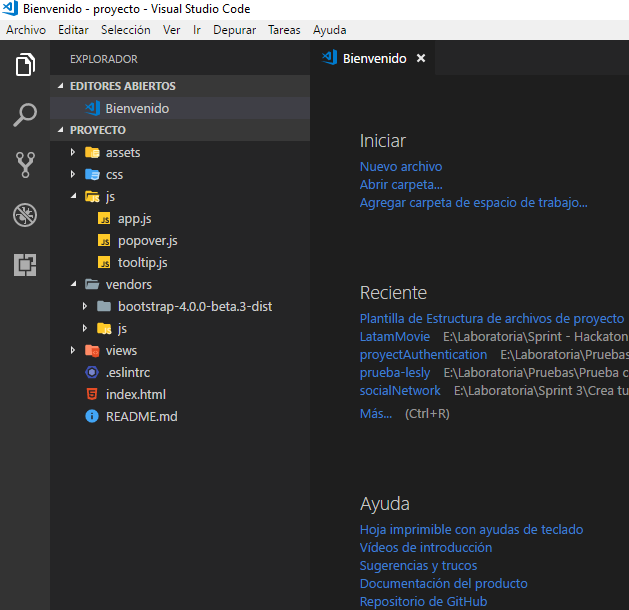

# Plantilla de Estructura para proyectos

## Carpetas
  1. **assets:** contiene 3 carpetas:
      - docs: contiene archivos incluídos en README (encuestas, anexos, sketch).
      - icons: contiene íconos en diferentes formatos a tu utilizar en el proyecto.
      - images: contiene imágenes incluídas en el proyecto.

  2. **css:** contiene un archivo principal:
      - main.css
      - archivos adicionales de estilos

  3. **js:** contiene un archivo principal: 
      - app.js
      - archivos adicionales de funcionalidad

  4. **vendors:** contiene 2 carpetas: 
      - bootstrap o el framework a utilizar
      - js y esta a su vez contiene un archivo jquery.
    
  5. **views** esta carpeta contiene archivos index adicionales.

## Archivos 
1. **.eslintrc:** corrige sintaxis.
2. **index.html:** archivo principal.
3. **README.md:** archivo con descripción del proyecto realizado.

### Aquí la muestra de la estructura del proyecto
